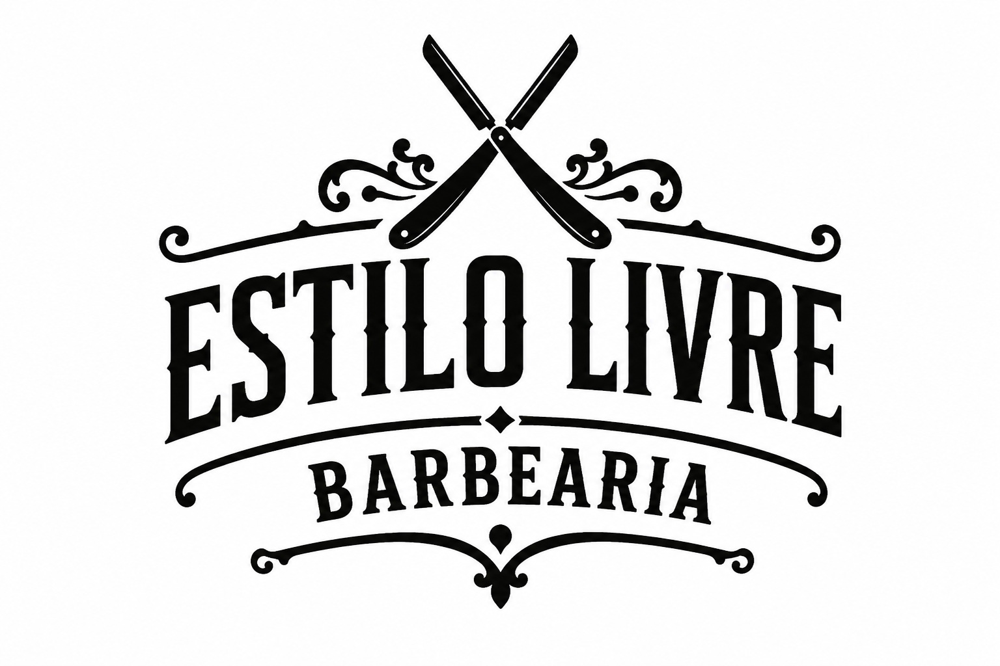
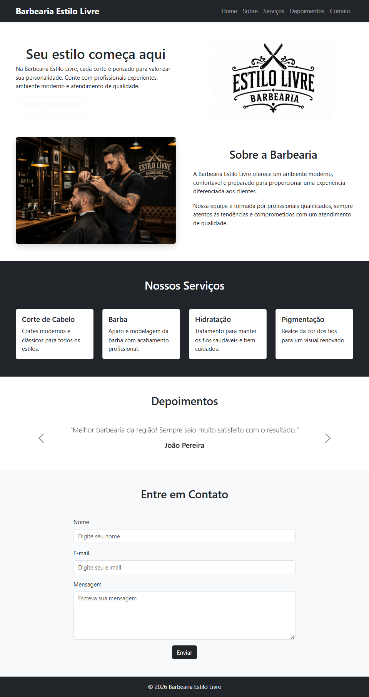

# 💈 Barbearia Estilo Livre

<p align="center">
  
</p>

<p align="center">
  Landing page desenvolvida com <strong>HTML5</strong>, <strong>CSS3</strong> e <strong>Bootstrap 5</strong>, com foco em responsividade, organização de código e utilização de componentes do framework.
</p>

<p align="center">
  
  
  
  
</p>

---

## 📖 Sobre o projeto

A **Barbearia Estilo Livre** é uma landing page fictícia desenvolvida para colocar em prática os conhecimentos adquiridos em HTML, CSS e Bootstrap.

O projeto foi criado com foco na construção de interfaces responsivas, organização do código e utilização de componentes do Bootstrap para criar um layout moderno e agradável.

---

## ✨ Funcionalidades

- ✔ Navbar responsiva
- ✔ Banner inicial (Home)
- ✔ Seção Sobre
- ✔ Cards de serviços
- ✔ Carousel de depoimentos
- ✔ Formulário de contato
- ✔ Layout responsivo para diferentes dispositivos

---

## 🛠 Tecnologias utilizadas

- HTML5
- CSS3
- Bootstrap 5.3

---

## 📱 Responsividade

O projeto foi desenvolvido seguindo o conceito **Mobile First**, proporcionando uma boa experiência em:

- 📱 Smartphones
- 📲 Tablets
- 💻 Desktops

---

## 📂 Estrutura do projeto

```text
barbearia-estilo-livre/
│
├── css/
│   └── styles.css
│
├── img/
│   ├── logo.jpg
│   ├── barbearia.jpg
│   └── preview.png
│
├── index.html
└── README.md
```

---

## 📸 Preview

```md

```

---

## 🚀 Como executar

1. Clone este repositório

```bash
git clone https://github.com/IsabelleLandini/barbearia-estilo-livre.git
```

2. Abra o arquivo `index.html` no navegador.

---

## 👩‍💻 Autora

**Isabelle Landini**


